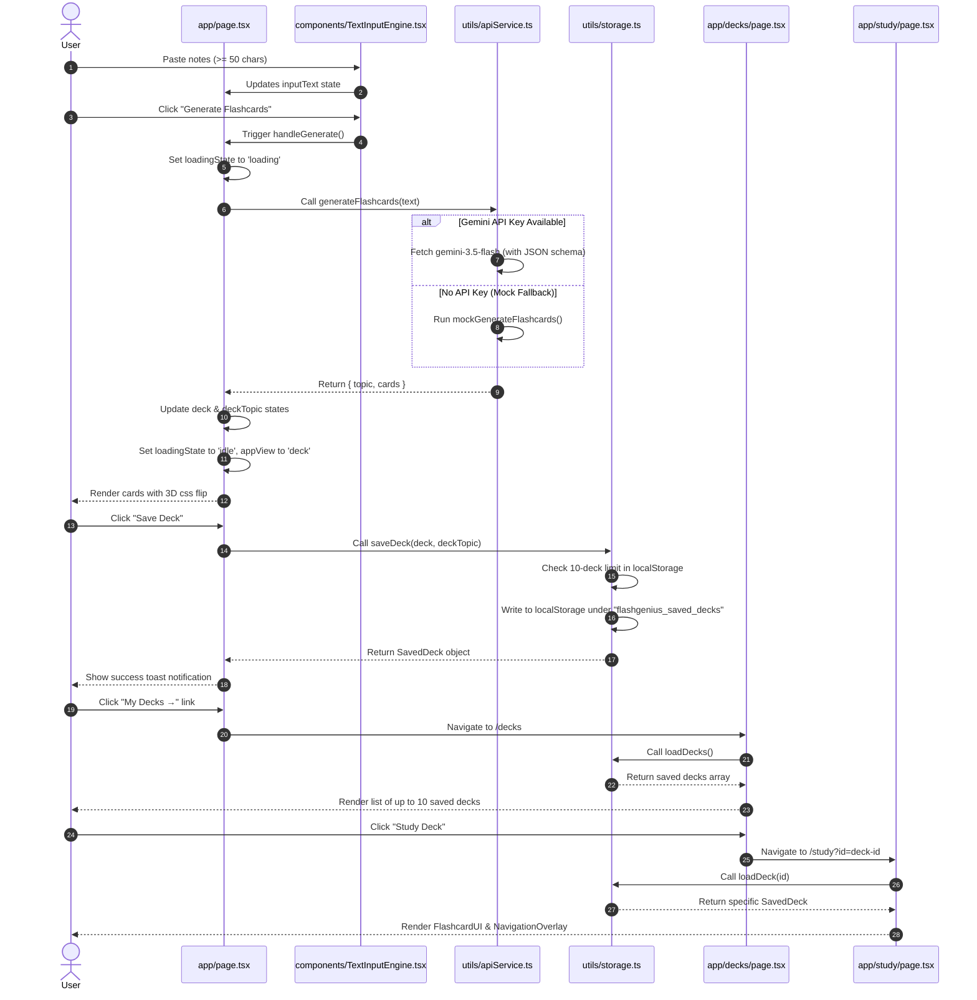

# Technical Implementation Walkthrough: FlashGenius

This walkthrough details the architecture, component communication sequence, and data flow of the FlashGenius multi-deck flashcard application.

---

## 1. Core Architectural Paradigm

The FlashGenius application is built as a stateless, client-side React application leveraging **Next.js static export** (`output: 'export'`). 

* **Hosting & Execution:** 100% client-side. There are no server-side API endpoints or databases.
* **Persistence:** Leverages the browser's `localStorage` to save, load, and manage up to 10 flashcard decks.
* **API Integration:** Connects directly to the Gemini API (`gemini-3.5-flash`) from the browser to generate cards and extract topics. If no API key is set, the application falls back to an in-browser mock parsing engine.

---

## 2. Component Communication & Data Flow

Below is the sequence of events and the component communication flow from raw note input to local persistence and interactive review.

---

## 3. Detailed Step-by-Step Data Flow

### Step 1: Input Validation & Boundaries
* The user enters notes in `TextInputEngine.tsx`. 
* Character length is enforced dynamically (`50` min, `10,000` max). The **Generate** button remains disabled until the minimum is met. 
* Any pasted content exceeding 10,000 characters is immediately truncated, and a warning toast is shown.

### Step 2: Generation Request & API Ingestion
* Upon submission, `handleGenerate()` is fired in `app/page.tsx`.
* It calls `generateFlashcards(text)` in `utils/apiService.ts`.
* The service queries the Gemini API with a strict structured JSON schema expecting a root object with `topic` (a short 2-3 word topic summary) and `cards` (an array of exactly 5 cards containing `id`, `question`, and `answer`).
* If the API fails or throws a rate-limit error (`429`), the app catches it and displays a user-friendly error message, unlocking the generation form.

### Step 3: Card Review State & Interaction
* Once the response is successfully parsed, the parent component saves the `deck` (the cards) and the `deckTopic` (the AI-generated topic) into React state.
* The UI transitions from `input` view to `deck` view. 
* The active card is rendered via `FlashcardUI.tsx`. Clicking the card toggles `isFlipped`, triggering a `rotateY(180deg)` CSS 3D animation.
* `NavigationOverlay.tsx` updates the navigation index (0 to 4) and resets `isFlipped` to `false` when the user clicks **Next** or **Previous**.

### Step 4: Storage Persistence & Quota Cap
* When the user clicks **Save Deck**, `saveDeck(cards, title)` is executed.
* The utility reads existing decks using `loadDecks()`. If there are already `10` decks saved, it rejects the save and alerts the user to delete a deck first.
* Otherwise, it creates a unique `deck-id` (using timestamp + random suffix), merges it with the topic title and cards, pushes it into the decks array, and stores the serialized array back to `localStorage` under `"flashgenius_saved_decks"`.
* If a legacy single-deck (saved under the old key `"flashgenius_saved_deck"`) is detected upon reading, it is automatically migrated into the new array format, and the old key is cleared.

### Step 5: Decks Library & Study Route
* Clicking **My Decks** routes the browser to `/decks`. This page reads the current saved array from `localStorage` and lists the active decks. Users can destroy any specific deck here (triggering `deleteDeck(id)`).
* Clicking **Study Deck** opens `/study?id=[id]`. This page parses the query string parameter, fetches that single deck's data using `loadDeck(id)`, and initializes a dedicated card-study session.

---

## 4. Modular File Allocation Matrix

| File Path | Responsibility | Exports |
|---|---|---|
| `app/page.tsx` | Main input workspace container. Coordinates generation, displays flashcard reviews, and prompts save actions. | `Page` (default) |
| `app/decks/page.tsx` | Library page. Lists all saved decks from localStorage (up to 10) with metadata, deletion triggers, and study links. | `DecksPage` (default) |
| `app/study/page.tsx` | Dedicated study page. Reads `id` query parameter, fetches the specified deck, and displays interactive flashcard slides. | `StudyDeckPage` (default) |
| `components/TextInputEngine.tsx` | Renders note input area, character constraints, and triggers generation. | `TextInputEngine` |
| `components/FlashcardUI.tsx` | Controls the 3D card layout and handles the click-to-flip CSS transforms. | `FlashcardUI` |
| `components/NavigationOverlay.tsx` | Renders previous/next selectors and card progress indicator. | `NavigationOverlay` |
| `utils/apiService.ts` | Handles Gemini API payloads, timeouts, rate limits, and fallback mock generator. | `generateFlashcards` |
| `utils/storage.ts` | Manages reading/writing JSON arrays in `localStorage`, enforces 10-deck limit, and performs legacy data migration. | `loadDecks`, `loadDeck`, `saveDeck`, `deleteDeck` |
